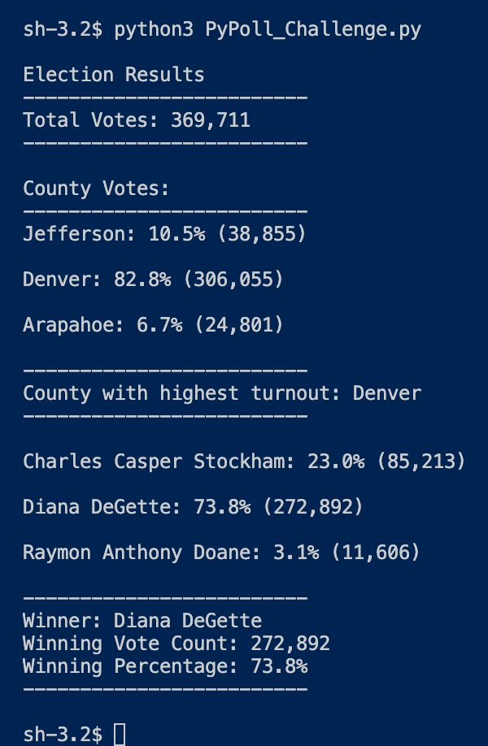

# Election-Analysis
 
 * Using the power of Python to automate the analysis of votes to help us determine the winner of the election. Using python, It enables us to provide Tom and the Election Commission formatted concise election data, allowing them to declare a winner. 

## Results

* There was a total of 369,711 votes cast in the election
* Jefferson county provided 10.5% (38,855) of the votes cast, Arapahoe county provided 6.7% (24,801) of votes cast.
* With the largest number of votes cast we have Denver county with 82.8% (306,055) of votes cast.

### Winner

* 2nd Runner-Up - Raymond Anthony Doane (11,606)
    - Received 3.1% of total votes cast.    
     

* Runner-Up - Charles Casper Stockham (85,213)
    - Received 23% of total votes cast.
     

* Winner - Diana DeGette (272,892)
    - Received 73.8% of total votes cast
     

## Election-Audit Summary 

* In conclusion, the program we have created ran and operated the Election-Audit smoothly and efficiently. Through the process you really find out how flexible and serviceable Python truly is. With quick modifications this code could easily handle a bigger Election with more candidates and total votes as well as a smaller, i.e. School President, election. Truly this code could be modified to fit almost any industry, with a quick change of variables, we could go from votes cast in an Elected Officials' election to votes cast for local and statewide laws that are on the ballot. 